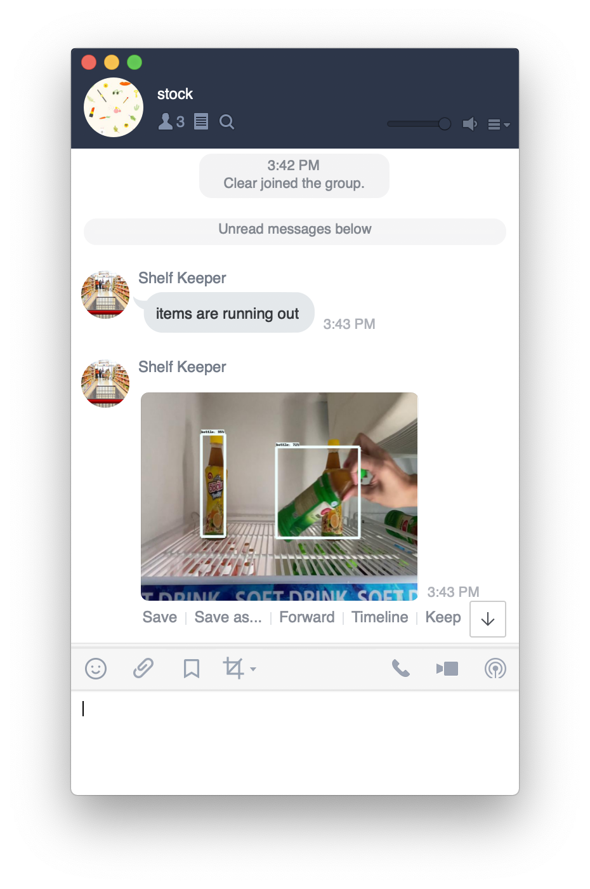

# retail_stock_counting
Count bottles on a shelf and alert via Line application when the items getting out of stock.

# Requirements
- Tensorflow Object Detection API
- Line Messaging API SDK for Go 
- AWS cli

# Installation
You can create all required stack on AWS include S3, Api Gateway, Lambda Function and CodePipeline by running the following command:
- aws cloudformation create-stack --stack-name StockCountStack --template-body file://cloudformation.yaml

Setup line developer account by following the link below, 
- https://developers.line.biz/en/docs/messaging-api/getting-started/#creating-a-channel

Install Tensorflow Object Detection API by following the line below, 
- https://github.com/tensorflow/models/tree/master/research/object_detection

Copy main.py to models/research/object_detection directory.

Now you can detect bottle and get alert via Line application.

